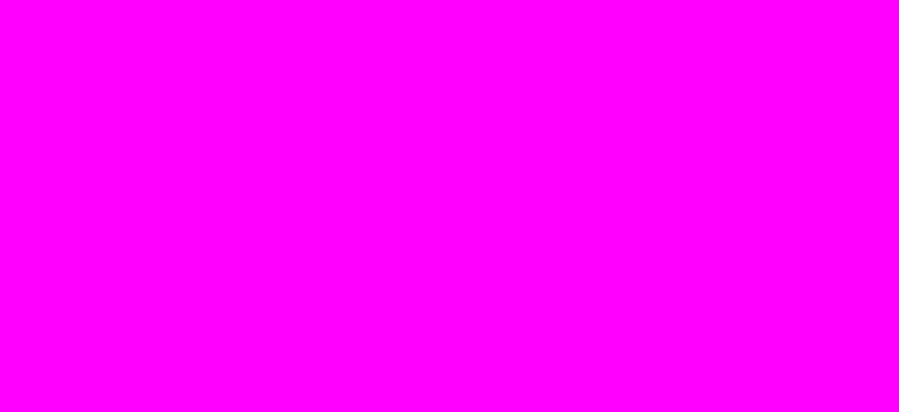
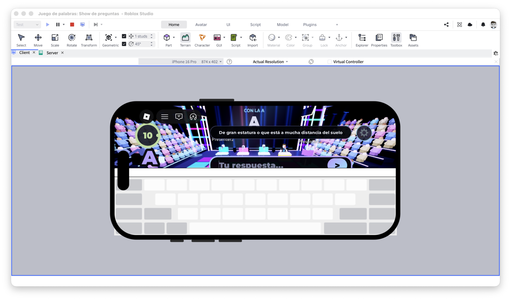

# roblox-studio-capture

[](LICENSE)
[](#requirements)
[](#requirements)
[](#install-as-a-claude-code-plugin)
[](https://github.com/JoaquinSantarcangelo/roblox-studio-capture/actions/workflows/ci.yml)

**Fixes: `capture_screenshot` returns solid magenta. `capture_device_matrix` returns solid
magenta. A Roblox Studio MCP server's screenshot tool goes uniform-color the moment a
playtest starts, even though the game is rendering fine on screen.**

If you searched something like *"roblox studio mcp screenshot magenta"*, *"capture_screenshot
solid color playtest"*, or *"robloxstudio-mcp capture_device_matrix broken"* — this is that
bug, reproduced and fixed below.

<p align="center">
  <br>
  <sub><b>Before</b> — the MCP tool's own <code>capture_screenshot</code>, called mid-playtest. Pixel-exact reproduction of its real output (uniform <code>#FF00FF</code>, same 1748×804 aspect ratio it reported).</sub>
</p>
<p align="center">
  <br>
  <sub><b>After</b> — <code>roblox-studio-capture shot</code>, same window, same instant. Unedited.</sub>
</p>

## Table of contents

- [The bug](#the-bug)
- [Root cause (best understanding so far)](#root-cause-best-understanding-so-far)
- [The fix](#the-fix)
- [Requirements](#requirements)
- [Install](#install)
  - [As a standalone script](#as-a-standalone-script)
  - [As a Claude Code plugin](#install-as-a-claude-code-plugin)
- [Usage](#usage)
- [For AI agents](#for-ai-agents)
- [Troubleshooting](#troubleshooting)
- [Contributing](#contributing)
- [License](#license)

## The bug

At least one popular Roblox Studio MCP server (`robloxstudio-mcp`) has a real, reproducible
bug: its `capture_screenshot` and `capture_device_matrix` tools return a **solid magenta
image** while a playtest is active — Edit mode is usually fine, it's specifically the
Play/Test path that breaks. The game itself renders completely normally on screen the whole
time; only the capture is wrong.

Confirmed live, side by side, same window, same instant: `capture_screenshot` returned
uniform magenta while this tool's `shot` command returned the full, correct render — HUD,
3D scene, device-simulated viewport, everything. See the screenshots above.

If you're driving Roblox Studio with an AI coding agent through an MCP server and its
screenshot tool goes solid-color the moment you start a playtest, you have this bug.

## Root cause (best understanding so far)

Not fully diagnosed from the MCP server's own source — this repo documents what's been
*confirmed externally*, not a fix submitted upstream. What's established:

- The bug is specific to an **active playtest**; Edit-mode capture through the same MCP
  tool is generally fine.
- The window's content is correct the entire time, verifiable by a human and by the
  operating system — only whatever internal path the MCP server uses to grab pixels during
  Play mode is affected.

This points at the MCP server's internal capture/rendering-context handling during Play
mode, not at Roblox itself. If you can pin down the exact mechanism, please open an issue or
PR — this repo would rather host one accurate paragraph than three guesses.

## The fix

Ask **macOS itself** for the window's pixels, bypassing the MCP server's capture path
entirely:

1. Enumerate on-screen windows via the low-level Window Server list
   (`CGWindowListCopyWindowInfo`) to find the Roblox-owned window and its **window ID**.
2. Capture that specific window with `screencapture -l<windowID>`, which reads its
   compositor backing store directly — regardless of which process owns it, or whether
   it's occluded by something else.

Two things deliberately **not** used, both of which failed while building this:

- **`screencapture -R x,y,w,h`** (a screen-*coordinate* region capture). It grabs whatever is
  physically on screen at those coordinates on the *currently active* virtual desktop
  (Space). If Roblox's window lives on a different Space, you silently capture the wrong
  app instead — this happened once while building this tool: a region capture caught a
  code editor window instead of Roblox Studio, purely because Studio was on another Space
  at the time.
- **AppleScript / System Events window queries.** They need macOS **Accessibility**
  permission — a bigger ask than necessary, and an easy wall to hit
  (`osascript is not allowed assistive access`). Window-ID capture needs only **Screen
  Recording** permission, which most development machines already have granted to their
  terminal app.

## Requirements

- macOS (uses CoreGraphics/Quartz APIs specific to it — see [Contributing](#contributing)
  for porting to other platforms).
- Swift (ships with Xcode Command Line Tools — run `xcode-select --install` if `swift` isn't
  found).
- **Screen Recording** permission for whatever process runs the command (your terminal app,
  your IDE's integrated terminal, etc.) — System Settings → Privacy & Security → Screen
  Recording. If a capture comes back solid **black**, this is why; see
  [Troubleshooting](#troubleshooting).

No other dependencies. This is a single Swift file that shells out to the `screencapture`
binary already on every Mac — nothing to build, nothing to `npm install`.

## Install

### As a standalone script

```bash
git clone https://github.com/JoaquinSantarcangelo/roblox-studio-capture.git
cd roblox-studio-capture
swift bin/roblox_studio_capture.swift list
```

### As a Claude Code plugin

```
/plugin marketplace add JoaquinSantarcangelo/roblox-studio-capture
/plugin install roblox-studio-capture@roblox-studio-capture
```

This installs a [skill](skills/roblox-studio-capture/SKILL.md) that Claude Code can reach
for automatically the moment it notices a Roblox Studio MCP screenshot tool returning a
suspicious uniform-color image during a playtest — no manual invocation needed once
installed. Verified end-to-end with `claude plugin validate`: 1 skill, 0 agents, 0 hooks,
0 MCP servers, ~225 tokens added per session.

## Usage

```bash
# List every on-screen window whose owner name contains "Roblox" (the default pattern):
swift bin/roblox_studio_capture.swift list

# Machine-readable:
swift bin/roblox_studio_capture.swift list --json

# Capture the largest matching window (the common case — toolbars/dialogs are always
# smaller than an actual viewport or Studio's own main window):
swift bin/roblox_studio_capture.swift shot --output /tmp/studio.png

# More than one Roblox-owned window open (e.g. Studio itself, plus a separate RobloxPlayer
# process from a multiplayer test)? List first, then target one explicitly:
swift bin/roblox_studio_capture.swift list
swift bin/roblox_studio_capture.swift shot --id 15936 --output /tmp/client.png

# Machine-readable capture result (path + which window got picked):
swift bin/roblox_studio_capture.swift shot --json
```

`shot` with no arguments auto-picks the largest on-screen window whose owner name contains
`"Roblox"` and writes a timestamped PNG under `$TMPDIR`, printing the path. Exit codes: `0`
success, `1` no matching window, `3` the underlying `screencapture` call failed, `64` bad
arguments.

## For AI agents

If you are an LLM-based coding agent (Claude Code or otherwise) working in Roblox Studio
through an MCP server, and a screenshot/capture tool call returns an image that is a single
uniform color — check a corner pixel, or downscale to 1×1 and read the average — during an
active playtest: that is this bug, not a rendering problem in the game. Run:

```bash
swift bin/roblox_studio_capture.swift shot --output <path>
```

then read the resulting PNG directly. It will show the actual rendered game. No permission
beyond macOS Screen Recording is required, and none of this depends on which MCP server or
which Roblox project you're working in — it operates entirely outside the MCP's own capture
path.

## Troubleshooting

**Solid black instead of magenta or real content.** macOS's own "permission denied" signal,
not a bug here. Grant Screen Recording permission to whatever application actually runs your
shell commands, then retry — most terminals pick it up immediately; a few need a restart
after granting.

**"No matching windows found."** Roblox Studio/Player might not be running, or its window
title/owner doesn't contain `"Roblox"`. Run `list --pattern ""` to see every on-screen
window and adjust `--pattern`.

**The wrong window gets captured.** Run `list` to see every candidate with its window ID and
size, then pass the right one explicitly with `shot --id <n>`.

## Contributing

Issues and PRs welcome — especially:

- A confirmed root cause for the underlying MCP bug (ideally traced in
  `robloxstudio-mcp`'s own source).
- A Windows/Linux equivalent — this is macOS-only today; Windows would need the Win32
  `PrintWindow`/`BitBlt` equivalent, Linux would depend on the compositor (X11 vs Wayland).
- Reports that this also fixes the same symptom against other Roblox MCP servers.

## License

MIT — see [LICENSE](LICENSE).
